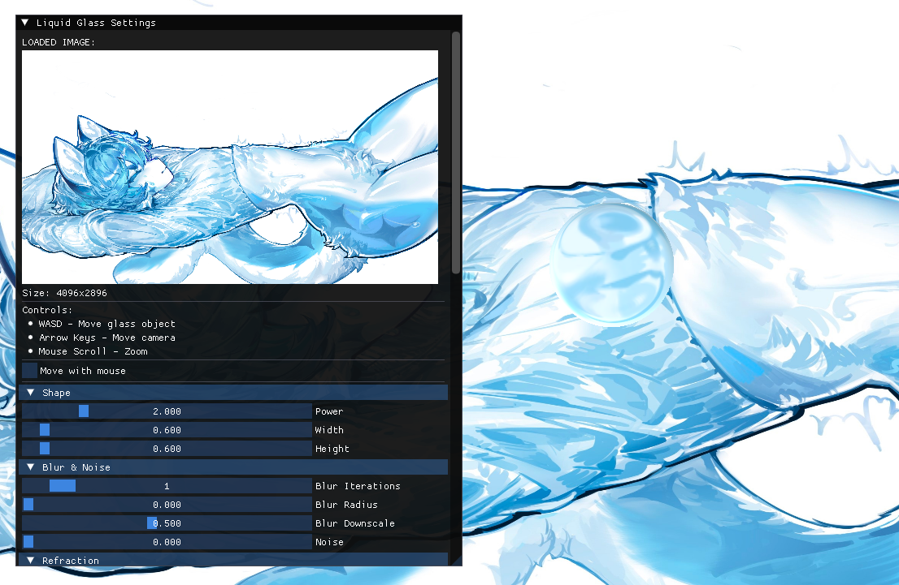

# Liquid Glass - HLSL Port

This is a port of the [Liquid Glass](https://github.com/OverShifted/LiquidGlass) shader from GLSL to HLSL. The original work was created by [OverShifted](https://github.com/OverShifted).

## Description

The original project implements a shader that emulates a liquid glass effect through refraction approximation using a signed distance field, along with blur, noise, and glow effects.

This repository contains the HLSL version of the shaders, adapted for use with DirectX, along with a test project built with ImGui.

## How to Run the Test

To see the shader in action, open the Visual Studio solution file:

`imgui-example/examples/imgui_examples.sln`

Then, compile and run the project.

## Credits & Acknowledgements

- **Original Shader**: All credit for the original shader algorithm and concept goes to **OverShifted**. 
  - [Original Repository](https://github.com/OverShifted/LiquidGlass)

- **Preview Image**: The preview image was drawn by [magic_dream00](https://x.com/magic_dream00).

- **Libraries Used**: This project uses the [stb](https://github.com/nothings/stb) single-file public domain libraries for image loading.

## License

The original project does not contain a license file. The HLSL porting work in this repository is licensed under the MIT License. Please be aware of the original author's rights when using this code.
